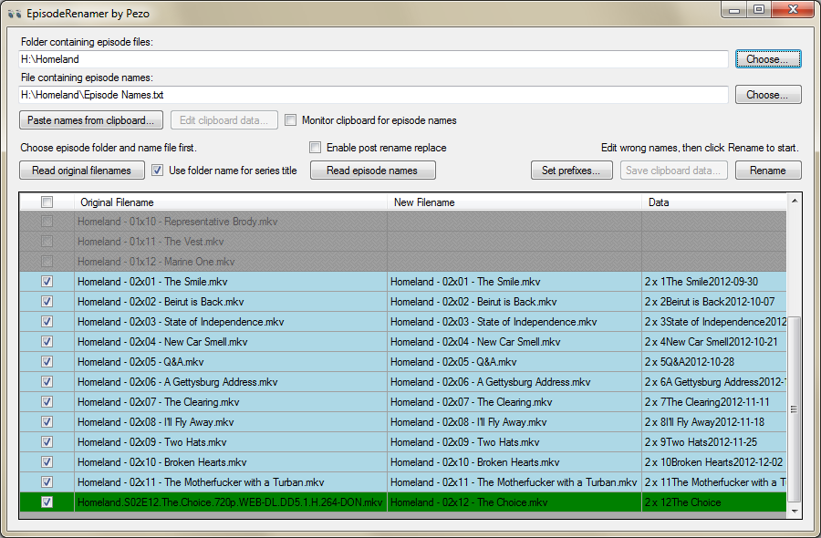

# EpisodeRenamer

This is somewhat obsolete, I haven't really updated the thing in a while and
rarely use it. TheTVDb have changed their episode list format in the meantime,
so there's no easy way of getting episode names into the program.

-------------

This program can be used to rename a bunch of series episodes to conform to a
certain format, like `Series - 01x17 - Title.mkv` or `Series.s01e17.Title.mkv`.

The season and episode prefix, as well as the separators can be set.  
The title can be extracted from a number of formats like a TheTVDb episode list
(also by watching the clipboard).

